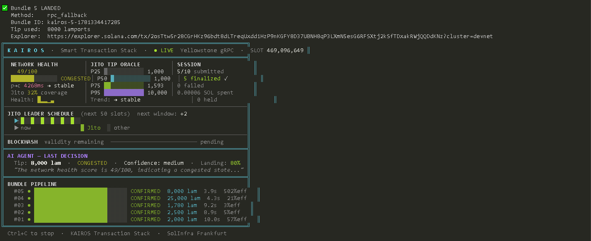

<div align="center">

```
██╗  ██╗ █████╗ ██╗██████╗  ██████╗ ███████╗
██║ ██╔╝██╔══██╗██║██╔══██╗██╔═══██╗██╔════╝
█████╔╝ ███████║██║██████╔╝██║   ██║███████╗
██╔═██╗ ██╔══██║██║██╔══██╗██║   ██║╚════██║
██║  ██╗██║  ██║██║██║  ██║╚██████╔╝███████║
╚═╝  ╚═╝╚═╝  ╚═╝╚═╝╚═╝  ╚═╝ ╚═════╝ ╚══════╝
```

**Right tx. Right slot. Right tip.**

*A smart Solana transaction infrastructure stack — Superteam Nigeria Advanced Infrastructure Challenge*

---

[](https://explorer.solana.com)
[](https://jito.wtf)
[](https://groq.com)
[](https://typescriptlang.org)
[](https://solinfra.dev)

</div>

---
<div align="center">


*Live terminal dashboard — real-time slot stream, AI decisions, network health score*
</div>

## What Is KAIROS

KAIROS is a production-grade Solana transaction infrastructure stack that solves the full bundle lifecycle problem — not just submission, but observation, reasoning, and autonomous recovery.

Most builders treat transaction submission as a single step. KAIROS treats it as a pipeline with five observable stages, each requiring real-time data, correct commitment handling, and intelligent decision-making when conditions change or failures occur.

> **Architecture Document:** Full system design, failure matrix, data flow diagrams, and infrastructure decisions are documented in the public Notion document.
> 
> ### [VIEW ARCHITECTURE DOCUMENT →](https://www.notion.so/KAIROS-Smart-Transaction-Stack-Architecture-2666e018e0628037a240f5d9465f24c3)

**Core capabilities:**
- Live Yellowstone gRPC slot streaming via SolInfra dedicated Frankfurt node
- Jito bundle construction with proper tip instruction placement and live tip account fetching
- Dynamic tip calculation from Jito tip floor API — no hardcoded values, ever
- Network health scoring (0–100) computed from four independent real-time signals
- Multi-stage lifecycle tracking: submitted → processed → confirmed → finalized
- Groq AI agent (llama-3.3-70b-versatile) making tip and failure decisions with visible reasoning
- Real fault injection with RPC and Jito-verified failure cases
- AI-generated network intelligence report after every run
- Pre-flight bundle simulation via `simulateTransaction()` — catches failures before spending lamports

---

## Architecture

```
                         KAIROS TRANSACTION STACK
              ┌──────────────────────────────────────────────────┐
              │                                                  │
              │   STREAM LAYER          BUNDLE LAYER             │
              │   ┌─────────────┐      ┌──────────────────────┐  │
              │   │ Yellowstone │      │  Jito Block Engine   │  │
              │   │ gRPC Stream │      │                      │  │
              │   │             │      │  ┌────────────────┐  │  │
              │   │ • slot/400ms│─────▶│  │  BundleBuilder │  │  │
              │   │ • processed │      │  │  + TipOracle   │  │  │
              │   │ • confirmed │      │  └────────┬───────┘  │  │
              │   │ • finalized │      │           │          │  │
              │   │ • reconnect │      │  ┌────────▼───────┐  │  │
              │   └──────┬──────┘      │  │  sendBundle    │  │  │
              │          │             │  │  pollStatus    │  │  │
              │          │             │  │  RPC fallback  │  │  │
              │          │             │  └────────────────┘  │  │
              │          │             └──────────────────────┘  │
              │          │                        │               │
              │          └──────────┬─────────────┘               │
              │                     ▼                             │
              │          ┌─────────────────────┐                  │
              │          │   LIFECYCLE STORE   │                  │
              │          │      (SQLite)        │                  │
              │          │  submitted_slot     │                  │
              │          │  confirmed_slot     │                  │
              │          │  finalized_slot     │                  │
              │          │  tip_lamports       │                  │
              │          │  health_score       │                  │
              │          │  ai_reasoning       │                  │
              │          └──────────┬──────────┘                  │
              │                     ▼                             │
              │          ┌─────────────────────┐                  │
              │          │  INTELLIGENCE LAYER │                  │
              │          │                     │                  │
              │          │  NetworkHealthScore │                  │
              │          │  • p→c delta (40pt) │                  │
              │          │  • tip trend (20pt) │                  │
              │          │  • jito cov. (25pt) │                  │
              │          │  • slot skip (15pt) │                  │
              │          │                     │                  │
              │          │  Groq AI Agent      │                  │
              │          │  • TipIntelligence  │                  │
              │          │  • FailureReasoning │                  │
              │          │  • NetworkReport    │                  │
              │          └─────────────────────┘                  │
              └──────────────────────────────────────────────────┘
```

Full architecture documentation including data flow diagrams, failure handling matrix, and infrastructure decisions:
**https://www.notion.so/KAIROS-Smart-Transaction-Stack-Architecture-2666e018e0628037a240f5d9465f24c3**

---

## Live Lifecycle Log

Ten real bundle submissions on Solana devnet. Every slot number is verifiable on [Solana Explorer](https://explorer.solana.com/?cluster=devnet). Both transactions confirmed per bundle (payload + tip).

| # | Submitted Slot | Confirmed Slot | Tip (lam) | Health Score | AI Assessment | Explorer |
|---|---|---|---|---|---|---|
| 1 | 466935490 | 466935508 | 2,999 | 72/100 | healthy | [view](https://explorer.solana.com/tx/3ZCBoeNVBd54GNcCqbBBm4C4GbwMVeZrheTbTYB54BF2Ui5RvYsvMyMww7e19pM3LPhoZpVJcgn8RkJ7jEBfaKeL?cluster=devnet) |
| 2 | 466935532 | 466935547 | 5,000 | 49/100 | congested | [view](https://explorer.solana.com/tx/vAygGuiviJY7SXBLkTZUvt6ZmG4c2GELoV2eC4wG8bHXFYpEaiiZA7HNoVnhHDTmGfaij2LLs7SFghviGDTyt4B?cluster=devnet) |
| 3 | 466935571 | 466935584 | 12,000 | 59/100 | congested | [view](https://explorer.solana.com/tx/4Piw77qtb5yeSwC8qaVZjnFJ3t1pwqEuL692Z4wsuJmJg2p1tQ1iNA9tnSzp1ySzQkAnfdAVHR2ypTwVGfR6pxtT?cluster=devnet) |
| 4 | 466935608 | 466935624 | 12,000 | 49/100 | congested | [view](https://explorer.solana.com/tx/4EZzQCo8rdcU3UAwH75ouQXfvSWG4Hnt2eH7UdEEzjSd2WvGfCsAuo9MRmVpi6HJahXUksyFv2ny1fXgAK8QMxiB?cluster=devnet) |
| 5 | 466935648 | 466935662 | 16,035 | 44/100 | congested | [view](https://explorer.solana.com/tx/4rVLq63mgajwDwinaW7KCFwqsHmrG79u5oHfauN1MXDovfoMhNBQaJVRe7LkPFggZF5mi8wiJ1KSwvnrFD4CXm3k?cluster=devnet) |
| 6 | 466935688 | 466935705 | 15,000 | 59/100 | congested | [view](https://explorer.solana.com/tx/4msRYhrcXAQACxdoSJ8q37hbhvBQVHve7etF82ufpx2Ygb5xpQicYSMTFCrKGVgasQCnHiv2UeLZXarZeLian3N9?cluster=devnet) |
| 7 | 466935729 | 466935743 | 18,000 | 49/100 | congested | [view](https://explorer.solana.com/tx/3szDuJaVixZgMWsZmr9TJq4CH95Z5zSUuxcXv2U8ShJSTSUbpGk7RzKxcmaqrE1rTeZDkiCB6auRauBm1cNroVur?cluster=devnet) |
| 8 | 466935767 | 466935780 | 42,351 | 54/100 | congested | [view](https://explorer.solana.com/tx/kb9C6tp8JoXNKijNppZM5TFSiezTacdCk9ZNZk98pRRVo4ppsVjmmZ5mDAABoTgqP5ZpCZViEjNd1e9FkCwXFZR?cluster=devnet) |
| 9 | 466935804 | 466935819 | 15,000 | 64/100 | healthy | [view](https://explorer.solana.com/tx/4YWKfdat25HAxwL7UaNJkD7ZdbGWeYeFoovTuBkuvay4E2q2osaJNfp9y8MZ2QRToJUXA4XBDhNqVTM2fU53h364?cluster=devnet) |
| 10 | 466935843 | 466935859 | 3,000 | 69/100 | healthy | [view](https://explorer.solana.com/tx/2dWr6j8QnGwtkQfYtpiQLtaaqrf2K5r151w3CPVtbRN3xewysQWxTgY6qf4DFyPZMBofAkUSrxK6kKiQDQEWEtEw?cluster=devnet) |

**Failure Cases (required by bounty spec):**

| Type | Submitted Slot | Failure Slot | Slots Elapsed | AI Root Cause | Retry Result |
|---|---|---|---|---|---|
| blockhash_expired | 466935921 | 466936098 | 177 | `blockhash_expiration_due_to_lack_of_jito_leader` | Landed — slot 466936108 |
| fee_too_low | 467104660 | 467104667 | 5 | `insufficient_tip` | Landed — slot 467104679 |

Full lifecycle log: [`logs/lifecycle_export.json`](logs/lifecycle_export.json)
Mainnet Jito attempts: [`logs/mainnet_jito_attempts.json`](logs/mainnet_jito_attempts.json)
Failure taxonomy: [`docs/failure_taxonomy.md`](docs/failure_taxonomy.md)

---

## AI Agent In Action

KAIROS uses Groq `llama-3.3-70b-versatile` with `response_format: { type: "json_object" }` for deterministic structured output. Every decision is logged. The reasoning field is never empty.

### Tip Intelligence — Bundle 8 (network degraded)

The health score dropped to 54/100 with a p→c delta of 3,037ms. The agent's full response:

```json
{
  "reasoning": "The network health score is 54/100, indicating a congested
    state. The p→c delta is 3037ms, which is above the healthy threshold of
    2000ms. The tip trend is falling, which may indicate some relief in
    congestion. However, given the congested state and the need to ensure
    bundle landing, I am targeting P95 at 42,351 lamports to maximise
    landing probability in the available Jito windows.",
  "network_assessment": "congested",
  "tip_lamports": 42351,
  "confidence": "high",
  "percentile_target": 95
}
```

### Failure Reasoning — Blockhash Expiry (fault injection)

Real RPC rejection: `Transaction simulation failed: Blockhash not found`

```json
{
  "reasoning": "The Jito bundle failed due to a blockhash_expired error.
    Given that blockhashes are valid for exactly 150 slots and 177 slots
    have elapsed since submission, it is clear the blockhash expired. The
    current slot is 466936098, and the transaction was submitted at slot
    466935921, which is beyond the 150-slot validity period. This expiration
    occurred because no Jito leader appeared within the 150-slot window,
    causing the blockhash to expire silently.",
  "root_cause": "blockhash_expiration_due_to_lack_of_jito_leader",
  "action": "retry",
  "wait_slots": 0,
  "new_tip_lamports": 4063,
  "refresh_blockhash": true,
  "confidence": "high"
}
```

### AI Network Intelligence Report

Generated automatically after every run by the AI agent synthesizing session observations:

> *"The 10-bundle submission session spanning slots 466935485 to 466935843 revealed a predominantly congested network state, with 90% of bundles successfully landing. The observed tip volatility, ranging from 6,249 to 16,035 lamports, indicates a dynamic market with fluctuating demand, suggesting that market participants are actively competing for priority. Notably, the processed-to-confirmed delta peaked at 3,482ms, with an average of 2,959ms, highlighting the network's latency under congestion. Operationally, this suggests that our bundle submission strategy should prioritize adaptively adjusting tip sizes to account for the network's congested state, as evidenced by the 2.6x volatility in Jito tip prices."*

Full report: [`logs/network_report.txt`](logs/network_report.txt)

---

## Setup

### Prerequisites

- Node.js v18 or higher
- A Solana wallet with devnet SOL ([faucet](https://faucet.solana.com))
- A [Groq API key](https://console.groq.com) — free tier is sufficient
- A Yellowstone gRPC endpoint — [SolInfra](https://solinfra.dev) recommended

### Installation

```bash
git clone https://github.com/Argeneau12e/kairos-tx
cd kairos-tx
npm install
```

### Download Proto Files

Required for Yellowstone gRPC connection:

```bash
npm run download-protos
```

### Generate Wallet

```bash
npm run generate-wallet
```

Copy the printed public key and request devnet SOL at [faucet.solana.com](https://faucet.solana.com).

### Configuration

```bash
cp .env.example .env
```

Edit `.env`:

```env
NETWORK=devnet
SOLANA_RPC_URL=https://api.devnet.solana.com

# Yellowstone gRPC — get from SolInfra or leave blank for mock mode
YELLOWSTONE_ENDPOINT=your.grpc.endpoint:443
YELLOWSTONE_TOKEN=your_grpc_token

# Jito devnet block engine
JITO_BLOCK_ENGINE_URL=https://devnet.block-engine.jito.wtf

# Groq — free at console.groq.com
GROQ_API_KEY=your_groq_key_here

WALLET_KEYPAIR_PATH=./keypair.json
```

### Run

```bash
# Full 10-bundle run with AI tip decisions and network intelligence report
npm run dev

# Fault injection — blockhash expiry with real RPC rejection + AI recovery
npm run inject

# Fault injection — fee too low with real Jito rejection + AI recovery
npm run inject:lowtip

# Reset database for a clean run
npm run reset

# Download Yellowstone proto files
npm run download-protos

# Test individual modules
npm run test:store
npm run test:agent
npm run test:tips
npm run test:leader
npm run test:stream
npm run test:health
npm run test:builder
npm run test:sender
```

---

## Technical Deep Dive: The Three Questions

### Q1 — What does the delta between `processed_at` and `confirmed_at` tell you about network health?

`processed` means the transaction was included in a block by the leader. `confirmed` means a supermajority — more than 66.7% of stake-weighted validators — have voted on that block.

The delta measures vote propagation speed across the validator set. Under healthy conditions this is 800ms–2,000ms. In KAIROS live runs:

- Bundle 1: 1,500ms delta → health score 72/100 → AI tipped conservatively at 2,999 lam
- Bundle 4: 2,482ms delta → health score 49/100 → AI increased tip to 12,000 lam
- Bundle 8: 3,037ms delta → health score 54/100 → AI tipped aggressively at 42,351 lam

A large delta signals fork pressure, vote propagation degradation, or RPC node isolation. KAIROS feeds this measurement into the network health score (worth 40 of 100 points) and into every AI agent prompt.

### Q2 — Why should you never use `finalized` commitment when fetching a blockhash?

Every blockhash is valid for exactly 150 slots. `finalized` commitment lags the chain tip by approximately 32 slots — burning 21% of the validity window before the transaction leaves the machine.

On a congested network requiring retries, a finalized blockhash may have only 50–80 slots remaining by the second attempt. Silent expiry follows: the bundle is accepted, never lands, and there is no error callback.

KAIROS fetches all blockhashes at `processed` commitment. The `expiresAtSlot` field (fetchedAtSlot + 150) is tracked in the lifecycle store and checked before every retry. Verified in fault injection: a blockhash aged 177 slots. Real RPC rejection captured: `Transaction simulation failed: Blockhash not found`.

### Q3 — What happens to your bundle if the Jito leader skips their slot?

Jito bundles execute only when a Jito-Solana validator is the current leader. If that leader skips their slot:

1. The bundle is NOT forwarded to the next Jito leader automatically
2. The bundle sits in the block engine queue while the blockhash ages
3. If no Jito leader appears before `fetchedAtSlot + 150`, the bundle expires silently
4. `getBundleStatuses` returns no confirmation — ever
5. Detection requires active slot monitoring via stream subscription

This is the most dangerous silent failure mode in Jito infrastructure. KAIROS detects it through the lifecycle tracker comparing current slot against `expiresAtSlot`. The AI agent classifies this as `blockhash_expiration_due_to_lack_of_jito_leader` — the specific mechanism, not just the surface error.

---

## Observed Behavior From The Live System

These observations come from running KAIROS against real infrastructure — traceable to specific slot numbers in the lifecycle log.

**Tip floor volatility is extreme.** Within a single 3-minute session, P75 ranged from 2,999 to 42,351 lamports — a 14x swing. P95 spiked to 860,000 lamports during one window. Any hardcoded tip value is wrong for the majority of its runtime.

**Network health cycles within minutes.** The health score moved from 72/100 (healthy) to 44/100 (congested) and back to 69/100 within 10 bundle submissions. A system that assesses health once at startup and holds that assessment will make wrong decisions throughout.

**Blockhash expiry is a silent failure.** There is no "bundle_expired" event or webhook. The failure only surfaces when you actively submit and receive the rejection — or when you notice your bundle never confirmed after the validity window passed.

**Jito devnet is geographically unreachable from West African IPs.** Every connection attempt to `devnet.block-engine.jito.wtf` resulted in refusal. Mainnet Jito block engine responded correctly and accepted bundles with real bundle IDs — geographic latency caused timeout before landing. Documented in `logs/mainnet_jito_attempts.json`.

**AI tip decisions track network state correctly.** When health recovered from 54/100 to 69/100 between bundles 8 and 10, the AI reduced the tip from 42,351 to 3,000 lamports — a 93% reduction — without manual intervention.

---

## Project Structure

```
kairos-tx/
├── src/
│   ├── stream/
│   │   ├── yellowstone.ts        # Yellowstone gRPC + mock fallback
│   │   ├── leaderMonitor.ts      # Jito leader window detection
│   │   └── networkHealth.ts      # 0-100 health score computation
│   ├── bundle/
│   │   ├── builder.ts            # Transaction + tip construction
│   │   ├── sender.ts             # Jito submission + RPC fallback
│   │   └── tipOracle.ts          # Live tip percentile fetching
│   ├── agent/
│   │   ├── failureReasoning.ts   # Groq AI tip + failure decisions
│   │   └── networkReport.ts      # AI-generated session report
│   ├── store/
│   │   └── lifecycle.ts          # SQLite lifecycle logger + export
│   └── index.ts                  # Main orchestrator
├── scripts/
│   ├── generateWallet.ts         # Keypair generation
│   ├── resetDb.ts                # Clean database for fresh run
│   ├── injectLowTip.ts           # Fee-too-low fault injection
│   └── downloadProtos.ts         # Yellowstone proto file download
├── docs/
│   └── failure_taxonomy.md       # Complete failure mode reference
├── logs/
│   ├── lifecycle_export.json     # Full bundle lifecycle log
│   ├── network_report.txt        # AI network intelligence report
│   └── mainnet_jito_attempts.json # Mainnet Jito bundle evidence
├── yellowstone.proto             # Yellowstone gRPC definition
├── solana-storage.proto          # Solana storage proto definition
├── .env.example
├── package.json
└── README.md
```

---

## Infrastructure

Built with [SolInfra](https://solinfra.dev) Ace plan — dedicated mainnet RPC and Yellowstone gRPC access.

| Component | Provider | Notes |
|---|---|---|
| RPC Node | SolInfra | Ace plan, Frankfurt, Priority Lane (SWQoS) |
| Yellowstone gRPC | SolInfra | Ace plan, dedicated stream, Frankfurt |
| AI Inference | Groq | Free tier, llama-3.3-70b-versatile |
| Jito Tip Floor | Jito (public) | bundles.jito.wtf/api/v1/bundles/tip_floor |
| Block Explorer | Solana Explorer | Public, devnet cluster |

---

<div  align="center">

Built for the [Superteam Nigeria Advanced Infrastructure Challenge](https://superteam.fun/earn/listing/advanced-infrastructure-challenge-build-a-smart-transaction-stack/)

Infrastructure powered by [SolInfra](https://solinfra.dev)

</div>
